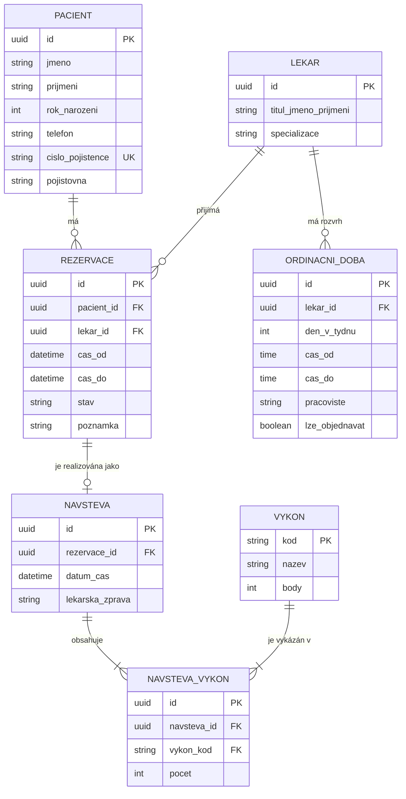

# Rezervace v ordinaci (Zadání A)
> **Předmět:** Pokročilé programování (PPRO) – ZS 2026/2027  
> **Fakulta:** Fakulta informatiky a managementu, Univerzita Hradec Králové (FIM UHK)  
> **Vyučující:** Dominik Palla (`dominik.palla@uhk.cz`)  
> **Klient:** MUDr. Jana Hrubá, *Ordinace Na Vyhlídce*  
> **Dokument:** Technická dokumentace, specifikace a Seznam rozhodnutí (Single Source of Truth)

---

## 1. Kontext a výchozí stav klienta

### O klientovi
Soukromá praxe *Ordinace Na Vyhlídce*. V ordinaci působí tři lékaři na částečné úvazky a paní Věra na recepci. V evidenci je přibližně 900 pacientů, z nichž zhruba polovina dochází pravidelně.

### Jak to v ordinaci funguje dnes
- Na recepci se používá papírový diář, do kterého se termíny zapisují obyčejnou tužkou.
- Když pacient volá, recepční paní Věra zdlouhavě hledá volné okno listováním v sešitě.
- Pokud lékař náhle onemocní, celý seznam dotčených pacientů se musí obvolávat z poznámek.
- Na konci každého měsíce paní Věra ručně přepisuje provedené výkony do tabulky pro zdravotní pojišťovny – tato neefektivní agenda jí zabere pokaždé celý podvečer.
- Za poslední rok se dvakrát stalo, že byli na stejný čas omylem objednáni dva pacienti ke stejnému lékaři, což vedlo k nepříjemným situacím v čekárně.

---

## 2. Požadavky klienta

### 2.1 Co klient chce (Funkční požadavky)
1. **Evidence pacientů:** Jméno, příjmení, rok narození, telefon, identifikátor pojištěnce (rodné číslo / číslo pojištěnce), zdravotní pojišťovna. Rychlé vyhledávání podle příjmení nebo telefonního čísla (pacient obojí hlásí hned při zahájení hovoru).
2. **Lékaři a ordinační hodiny:** Každý lékař má specifické dny a ordinační hodiny. Systém musí reflektovat, že jeden z lékařů ordinuje v úterý odpoledne na jiné adrese, kde nelze přijímat objednávky přes tuto ordinaci.
3. **Rezervace na konkrétní termín u konkrétního lékaře:** Rezervaci zakládá recepce. Součástí je textová poznámka s důvodem návštěvy.
4. **Záznam o návštěvě a provedené výkony:** Po příchodu pacienta a proběhnutí vyšetření se zaeviduje průběh. Výkony se vybírají z centrálního číselníku (kód výkonu, název, bodové ohodnocení). U jedné návštěvy lze vykázat více výkonů současně, u vybraných výkonů se eviduje i počet opakování (např. 3 aplikace).
5. **Zrušení rezervace a sledování spolehlivosti:** Pacient může rezervaci odvolat. Lékař chce mít přehled o pacientech, kteří termíny ruší opakovaně.
6. **Přehled volných termínů:** Klíčová funkce pro recepci – zobrazení kalendářního týdne pro konkrétního lékaře s okamžitým vyznačením volných slotů.
7. **Měsíční výkaz pro pojišťovnu:** Generování souhrnu provedených výkonů a celkového součtu bodů za zvolený kalendářní měsíc a vybraného lékaře.

### 2.2 Na čem klient trvá (Obchodní pravidla a invarianty)
- **Zákaz překryvu rezervací:** Dvě rezervace na shodný časový úsek u stejného lékaře nesmí jít založit za žádných okolností (ani ručním zásahem, ani omylem). Vynuceno na úrovni databáze a doménových validačních pravidel.
- **Ordinační hodiny jako striktní mantinel:** Rezervaci nelze založit mimo platné ordinační hodiny daného lékaře.
- **Integrita vykázaných výkonů:** Zdravotní výkon nelze přiřadit k návštěvě/termínu, který se v reálu ještě neuskutečnil (vyloučení vykazování do budoucna).
- **Trvalá historie (nemazatelnost):** Historie pacienta a proběhlých návštěv se fyzicky nemaže kvůli právní doložitelnosti poskytnuté péče.

### 2.3 Co klient prohodil mimochodem (Nároky na UX a rozšiřitelnost)
- *„Musí to zvládnout paní Věra, ta s počítačem moc nekamarádí.“* $\to$ Rozhraní musí být maximálně přehledné, bez zbytečných kliků navíc, s velkými a srozumitelnými ovládacími prvky.
- *„Když zvoní telefon, nemůžu čekat, až se to načte.“* $\to$ Okamžitá odezva vyhledávání pacientů (debounce vyhledávání, indexy v DB).
- *„Bylo by hezké, kdybych to viděla i na tabletu, ale to nespěchá.“* $\to$ Responzivní webové rozhraní přizpůsobené i pro dotykové obrazovky.
- *„Pacienti by se možná mohli objednávat sami přes internet, ale bojím se toho.“* $\to$ Architektura a API musí být navrženy tak, aby umožnily budoucí napojení pacientského samoobslužného portálu bez nutnosti refaktoringu jádra systému.

---

## 3. Seznam rozhodnutí (Otevřené body klienta)

Následující tabulka dokumentuje rozhodnutí ke všem otevřeným bodům specifikovaným v zadání:

| # | Otevřený bod klienta | Přijaté rozhodnutí a technické řešení | Zdůvodnění |
|---|----------------------|---------------------------------------|------------|
| **1** | **Délka jednoho termínu** (*„podle toho, co se dělá“ vs. mřížka*) | Zavedena pevná časová mřížka s krokem **15 minut** (základní slot). Rezervace má počáteční čas a délku danou celočíselným násobkem základního slotu (15, 30, 45, 60 minut). Typ vyšetření předvyplní doporučenou délku. | Umožňuje zachovat přehledný vizuální kalendář pro recepci (mřížku) a zároveň flexibilitu pro komplexnější zákroky. |
| **2** | **Kdo zakládá rezervaci** (*recepce vs. pacienti přes internet*) | V 1. fázi je zápis umožněn **výhradně recepci (paní Věře)**. Systém je však postaven na modulární třívrstvé architektuře s autorizovaným REST API. | Paní Věra neztratí kontrolu nad diářem a eliminují se obavy lékařky. Budoucí zapojení pacientského portálu bude pouze novým klientem téhož API. |
| **3** | **Co se zrušenou rezervací** (*odstranění z diáře vs. statistika nespolehlivých*) | Implementován stavový automat rezervace (`PLANOVANA`, `PROBEHLA`, `ZRUSENA_PACIENTEM`, `ZRUSENA_LEKAREM`). Zrušená rezervace **uvolní časový slot v kalendáři**, ale její záznam zůstává v DB s časovým razítkem a důvodem. | Kalendář zůstává čistý a volný pro nové pacienty, zatímco systém dokáže okamžitě spočítat a zobrazit statistiku častých rušení pacienta. |
| **4** | **Totožnost pacienta a duplicity** (*paní Nováková je v diáři 3x*) | Primárním unikátním identifikátorem pacienta je **číslo pojištěnce (rodné číslo)**. Při zadávání jména a telefonu systém provádí našeptávání a varuje před vznikem duplicit. | Zamezí se vícenásobné registraci stejného člověka pod mírně odlišným zápisem jména, což je klíčové pro správné vykazování pojišťovnám. |
| **5** | **Nemoc lékaře** (*jak postupovat při výpadku*) | Funkce **„Nahlásit nepřítomnost lékaře“** pro vybraný interval. Systém automaticky převede všechny kolidující rezervace do stavu `K_PREOBJEDNANI` a vytvoří přehledný pracovní frontový seznam (Call-list) pro paní Věru. | Nemoc nelze řešit plnou automatizací, protože pacienti vyžadují lidský přístup a domluvu náhradního termínu; paní Věra však dostane přesný seznam koho a kdy kontaktovat. |

---

## 4. Povinné minimum a technická architektura

Systém striktně naplňuje veškeré požadavky semestrálního projektu předmětu PPRO:

### 4.1 Třívrstvá architektura se závislostmi jedním směrem
Závislosti směřují výhradně shora dolů:
1. **Prezentační vrstva (Web UI / Controller / API)**: Zpracování HTTP požadavků, validace vstupních DTO, formátování odpovědí pro recepci.
2. **Aplikační a doménová vrstva (Services & Domain Model)**: Obchodní logika, validace překryvů rezervací, správa stavů, kalkulace měsíčních bodových výkazů. Nezávisí na prezentační vrstvě.
3. **Infrastrukturní a datová vrstva (Repositories & Database Context)**: Mapování entit na relační databázi, transakční zpracování, migrační skripty.

### 4.2 Relační databáze a migrace
- Provozována v kontejneru Docker.
- Všechny změny schématu jsou řízeny verzovanými migracemi.
- Použití cizích klíčů, unikátních indexů a kontrolních omezení (CHECK constraints) pro zajištění integrity dat.

### 4.3 Datový model (minimálně 5 entit + M:N vazba)
Model obsahuje tyto klíčové doménové entity:
1. `Pacient` – osobní a kontaktní údaje, číslo pojištěnce, kód pojišťovny.
2. `Lekar` – identifikační údaje lékaře, specializace, příznak aktivity.
3. `OrdinacniDoba` – ordinační okna lékaře (den v týdnu, platnost od-do, ordinace/adresa).
4. `Rezervace` – vazba na pacienta a lékaře, plánovaný čas začátku a konce, stav, důvod návštěvy.
5. `Navsteva` – záznam o reálně proběhlé návštěvě vázaný na rezervaci, datum a čas realizace, poznámka lékaře.
6. `Vykon` – číselník zdravotních výkonů (kód výkonu, popis, bodová hodnota).
7. `NavstevaVykon` – **asociační entita vazby M:N** spojující `Navsteva` a `Vykon` s dodatečným atributem `pocet` (počet aplikací/provedení daného výkonu).



---

## 5. Technologický stack a struktura projektu

### Použité technologie
- **Jazyk & Platforma:** Java 21 LTS (OpenJDK)
- **Framework:** Spring Boot 3.3.4 (Spring Web, Spring Data JPA, Bean Validation, Thymeleaf)
- **Relační databáze:** PostgreSQL 16 (v Docker kontejneru)
- **Databázové migrace:** Flyway (verzované SQL migrace v `src/main/resources/db/migration`)
- **Prezentační vrstva:** Thymeleaf + moderní Vanilla CSS (optimalizováno pro ergonomii recepce) & REST API
- **Testování:** JUnit 5, Mockito (unit testy byznys logiky), MockMvc & H2 (integrační testy kontrolerů)
- **Kontejnerizace:** Multi-stage Dockerfile a Docker Compose

### Adresářová struktura třívrstvé architektury
```
src/main/java/cz/uhk/fim/ppro/ordinace/
├── OrdinaceApplication.java        # Vstupní bod Spring Boot aplikace
├── presentation/                   # 1. Prezentační vrstva
│   ├── controller/                 # PacientWebController (UI) & PacientRestController (REST API)
│   ├── dto/                        # PacientCreateDto, PacientResponseDto
│   └── GlobalExceptionHandler.java # Centralizované ošetření chyb a mapování stavových kódů
├── application/                    # 2. Aplikační a doménová vrstva
│   ├── model/                      # Doménová entita Pacient
│   ├── service/                    # PacientService (vyhledávání, validace, detekce duplicit)
│   └── exception/                  # Doménové výjimky (DuplicateEntityException, BusinessRuleException...)
└── infrastructure/                 # 3. Infrastrukturní a datová vrstva
    └── repository/                 # PacientRepository (Spring Data JPA, SQL dotazy pro fulltext)
```

---

## 6. Spuštění a provoz systému

Systém je plně kontejnerizován pro snadné lokální spuštění bez nutnosti instalace lokálních závislostí:

```bash
# Spuštění kompletního prostředí (aplikace + relační databáze PostgreSQL + automatické Flyway migrace)
docker compose up --build
```

Po spuštění je systém dostupný na adresách:
- **Webové rozhraní pro recepci (paní Věru):** [http://localhost:8080](http://localhost:8080)
- **REST API pro integrace:** [http://localhost:8080/api/pacienti](http://localhost:8080/api/pacienti)

### Spuštění testů
Unit a integrační testy ověřují správné chování vyhledávání, detekci duplicit a zákaz mazání historie pacienta:
```bash
docker run --rm -v "${PWD}:/app" -w /app maven:3.9-eclipse-temurin-21-alpine mvn test
```

---

## 7. Protokol o postupu a změnách (Decision & Change Log)

- **2026-09-30:**
  - Inicializace git repozitáře a propojení s GitHub (`AlexMusil/PPRO26`).
  - Vytvoření pravidel asistenta v [`AGENTS.md`](file:///c:/Users/alsug/Documents/FIM/Ing/ppro26/AGENTS.md) (commit s `-m`, zákaz push bez explicitního souhlasu, udržování dokumentace).
  - Vytvoření výchozí technické dokumentace a Seznamu rozhodnutí v [`README.md`](file:///c:/Users/alsug/Documents/FIM/Ing/ppro26/README.md) pro Zadání A (Rezervace v ordinaci).
  - Nastavení git pre-commit hooku pro kontrolu aktuálnosti dokumentace.
  - **Pilotní demo – Entita Pacient:**
    - Zvolen technologický stack Java 21, Spring Boot 3.3.4, PostgreSQL 16 a Flyway.
    - Implementována třívrstvá architektura (`presentation` $\to$ `application` $\to$ `infrastructure`).
    - Vytvořena migrace `V1__create_pacient_table.sql` a seed skript `V2__seed_pacienti.sql` s 10 syntetickými záznamy pacientů (včetně případů z příběhu klienta: paní Nováková, paní Krátká).
    - Implementována doménová pravidla v `PacientService`: ochrana před duplicitami (unikátní rodné číslo / číslo pojištěnce, shoda jméno + telefon), striktní zákaz mazání historie pacienta (`BusinessRuleException`).
    - Vytvořeno ergonomické webové UI (`pacienti.html`, `style.css`) s okamžitým telefonním vyhledávačem a přehledným zápisem nového pacienta.
    - Připraven `Dockerfile` (multi-stage) a `docker-compose.yml` s healthcheckem pro PostgreSQL.
    - Implementována sada unit a integračních testů (`PacientServiceTest`, `PacientRestControllerTest`).
